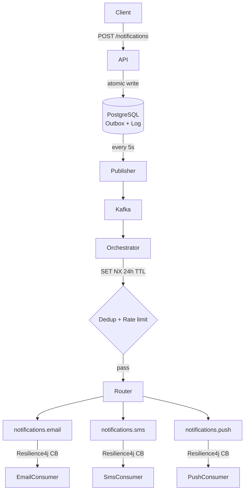

---

# Notification Orchestrator

Async notification delivery over Kafka with deduplication,
rate limiting, and circuit breakers across email, SMS, and push.

## Architecture

## Engineering decisions

**Transactional Outbox**  
NotificationLog and OutboxEvent written in one Postgres transaction.
Scheduler publishes unpublished events every 5s.
Crash mid-flight — nothing lost, retries on restart.

**Idempotency**  
Redis `SET NX` with 24h TTL. One atomic operation.
No GET-then-SET race condition under concurrent load.

**Rate limiting**  
Redis `INCR + EXPIRE` — 100 req/min per client.
Known tradeoff: boundary burst at window edge allows 200 req in 2 seconds.
Token bucket eliminates this — left visible as a deliberate tradeoff.

**Circuit breakers**  
Resilience4j trips at 15% error rate over a 10-call sliding window.
Half-open state probes with 3 trial calls before closing.
Prevents thundering herd on provider recovery.

**Priority lanes**  
HIGH and NORMAL on separate Kafka partitions.
OTPs never queue behind marketing blasts.

## Stack

Java 17 · Spring Boot 3.2 · Apache Kafka · PostgreSQL 15 · Redis 7 · Resilience4j · Zipkin · Docker

## 🚀 Running Locally

`cp .env.example .env` → `docker compose up -d` → `./mvnw spring-boot:run`

---
